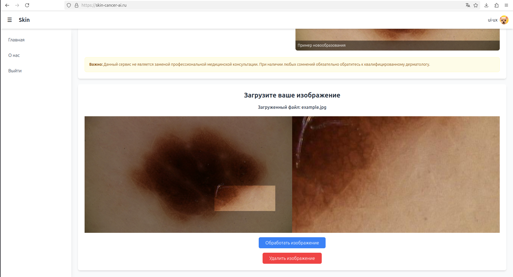
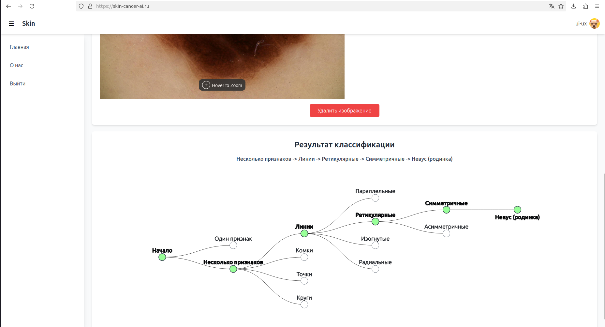
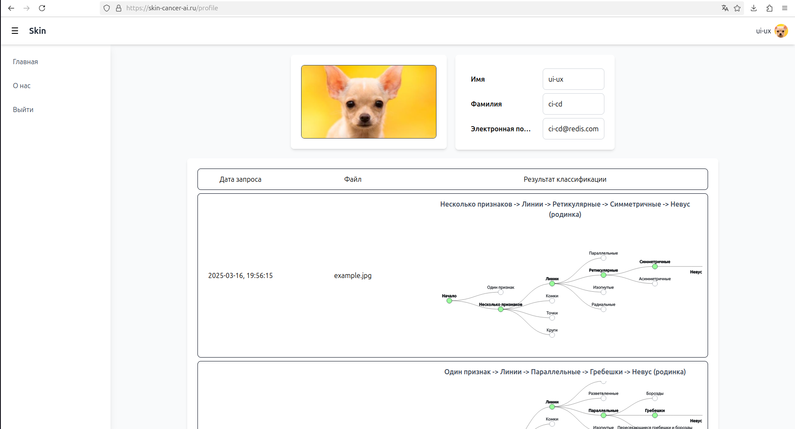

# Melanoma Detection using Kittler's Method

[www.skin-cancer-ai.ru](https://skin-cancer-ai.ru) — Visit the project website for more information and to access the full system.

## Project Description
This project is designed for the automated recognition of melanoma in dermatoscopic images using Kittler's method. [Kittler's method](https://www.researchgate.net/publication/224895107_Dermatoscopy_of_unpigmented_lesions_of_the_skin_A_new_classification_of_vessel_morphology_based_on_pattern_analysis) is based on analyzing the hierarchical structure of image features, allowing for the construction of a detailed decision tree.

The analysis process begins with image preprocessing, including normalization, noise removal, and segmentation. The models then analyze key morphological features such as the presence and distribution of globules, dots, lines, reticular structures, and other patterns characteristic of melanoma. Based on the detected characteristics, a sequence of decisions is made, represented in the form of a tree. This tree allows the user not only to see the final classification result but also to understand which features were crucial in the diagnostic process.

The chosen approach ensures interpretability of the results, which is especially important in medical applications where understanding why a model arrived at a particular conclusion is essential. Thus, this project not only automates the image analysis process but also makes it transparent and explainable for specialists.

## Project Structure

### 1. **Backend**
Implemented in Python and includes:
- `FastAPI` for the API.
- `MinIO` for image storage.
- `SQLAlchemy` for database operations.
- Docker containerization.

#### **Database Structure**

The system utilizes a relational database with three primary tables:

1. **`users`** – Stores registered user information, including login credentials, email, and registration date.
2. **`files`** – Contains metadata about uploaded images, such as file name, file path, and storage bucket (MinIO).
3. **`classification_results`** – Stores image classification results, linking them to both the user and the corresponding file. It also tracks processing status and final diagnostic output.

#### **Automated Processes:**
- Each uploaded image is assigned a unique identifier, which is used throughout the classification process.
- After model inference, the classification result is automatically stored in the database.
- Users have access to the latest three classification results for easy monitoring.
- Older results can be automatically archived or deleted to optimize storage.

#### **Image Storage with MinIO**

The project uses **MinIO**, a high-performance, S3-compatible object storage solution, to store and manage uploaded dermatoscopic images. 

- **Reliability** – Ensures data integrity with built-in redundancy and replication features.
- **Performance** – Optimized for handling large image files with fast access times.
- **Compatibility** – Works seamlessly with existing cloud and on-premise infrastructure.

MinIO allows the system to securely store, retrieve, and manage images while integrating smoothly with the backend for classification and result tracking.

### 2. **Frontend**

The frontend is built using **React** and provides an intuitive interface for interacting with the melanoma classification system. It includes the following key pages:

#### **1. Home Page**
- Displays an overview of the project, explaining its purpose and methodology.
- After user registration, the interface unlocks the ability to upload dermatoscopic images for analysis.
- Users can interactively zoom in on specific parts of an image to examine details before submitting it for classification.

#### **2. Classification Results & Decision Tree**
- After image classification, the system generates and displays a **decision tree**.
- The predicted path is visually highlighted, helping users understand the classification process.
- Each node in the tree represents a decision point, allowing users to explore possible classification pathways.

#### **3. Registration & Authorization Pages**
- **Registration**: Users can create an account by providing basic information such as email, username, and password.
- **Authorization**: Existing users can log in to access their account, ensuring personalized access to their data and uploaded images.
- Both pages are user-friendly with clear instructions to ensure a smooth sign-up or login experience.

#### **4. User Account**
- The **personal account** section allows users to view and manage their profile details, including personal information and image uploads.
- **Classification History**: Users can see the results of their last three image classifications, displayed with timestamps and the corresponding decision tree visualizations.
- The system provides an option to download or view detailed reports for each image submitted, helping users track their analysis over time.

### 3. **ML Model**

This system includes a set of models designed for analyzing structural elements of dermatoscopic images. The models work together to accurately identify patterns and classify various features in the images.

- **YOLO & UNET for Segmentation**: 
  - **UNET** is used for segmenting the dermatoscopic image to identify key areas of interest (such as lesions, borders, and other structures). 
  - **YOLO** (You Only Look Once) is employed to detect objects in the segmented images, ensuring that various structures like globules, reticular structures, and streaks are correctly recognized.

- **Classifiers for Pattern Identification**:
  - After the segmentation, various classifiers are used to identify specific patterns in the dermatoscopic images, such as:
    - Dots
    - Globules
    - Lines
    - Other dermoscopic features
  - These classifiers rely on advanced algorithms, such as decision trees and neural networks, to categorize and label the features accurately.

#### **Key Files in the Machine Learning Block**

- `ml/main.py`: The main script that handles image analysis. This script coordinates the entire pipeline, from image segmentation using UNET+YOLO to classification using various models and generating the final decision tree.
  
- `ml/mask_builder.py`: Responsible for processing the masks generated from UNET+YOLO. This file helps in refining the segmented areas, preparing them for further classification.
  
- `ml/weight/`: Directory containing the stored model weights for the neural networks and classifiers. These weights have been trained with high precision to ensure accurate results across various dermatoscopic images.

- `ml/...`: Different classification models.

#### **Process Flow and Decision Tree**

- **Mask Generation**: 
  - The **mask** is generated using a combination of **UNET** and **YOLO** models. The image is first segmented to identify critical areas, followed by detection of objects or structures within these areas.
  
- **Classification with Kitler Algorithm**:
  - Once the mask is built, the **Kitler algorithm** is applied. This algorithm works by passing the segmented and processed image through multiple classifiers. Each classifier identifies specific patterns, and based on the detected features, the image progresses further down the decision tree.
  
- **Decision Tree**:
  - The classifiers transmit the image data to a decision tree, where each node represents a decision point based on detected features.
  - The process continues through the decision tree until a final classification is reached.
  - The entire process is visualized in the form of a decision tree, which can be reviewed at any point for a deeper understanding of the classification pathway.
  - The complete, implemented decision tree can be accessed via the provided [link](https://miro.com/app/board/uXjVMwEeFQ8=/).

#### **Parallel Processing & Logging**

- **Parallel Classification**: 
  - The machine learning module is designed to handle up to **4 parallel classification requests**. This is achieved by dividing the tasks across multiple threads, enabling faster processing and reducing wait times for users.
  
- **Logging**: 
  - The ML block generates **logs** for all module runs, allowing developers and users to track the performance of each module, understand any issues encountered, and gain insights into the classification process.
  - These logs are helpful for troubleshooting and ensuring the smooth operation of the entire system.

### 3. **NGINX**
Used as a reverse proxy server to route requests to the backend and frontend.

## **Acknowledgements**

We would like to extend our heartfelt thanks to all the developers who have contributed to this project. Their expertise, creativity, and dedication have been essential in bringing this project to life. We also want to give special recognition to **[Кегелик Николай Александрович](https://github.com/Horokami)**, who played a key role in setting up and refining the frontend, ensuring a smooth and intuitive user experience.

## **Useful Links**

- [UNET - Skin Cancer Segmentation](https://www.kaggle.com/code/mihailodin1/skin-cancer-segmentation-unet) — Notebook for training the UNET model for skin cancer segmentation.
- [Color Classification](https://www.kaggle.com/code/mihailodin1/skin-cancer-color) — Notebook for training the color classification model used in our project.
- [One vs Several - Melanoma Classification](https://www.kaggle.com/code/mihailodin1/one-many-mell-cl) — Notebook for the "One vs Several" melanoma classification model, as part of the decision tree.

## **Acknowledgements to the Tech Stack**

We would also like to thank the following technologies and frameworks that helped make this project a success:
- **YOLO** for their powerful image segmentation capabilities.
- **PyTorch** for providing flexible and efficient machine learning environments.
- **Scikit-learn** for implementing various classification algorithms.
- **FastAPI** for enabling smooth deployment and API management.
- **Docker** for streamlining the development and deployment process.

## **License**

This project is licensed under the **MIT License**. You are free to use, modify, and distribute the code, provided you include the original copyright and license notice in any copies of the software. See the [LICENSE](LICENSE.txt) file for more details.

