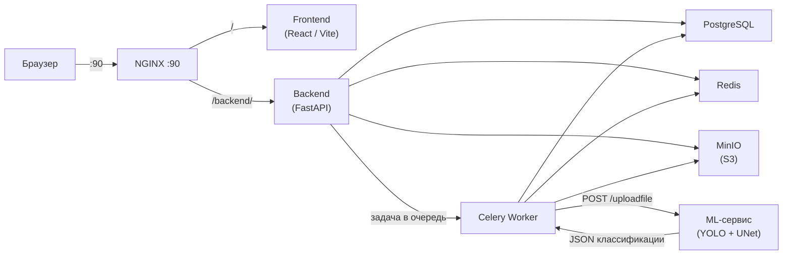

# Обнаружение меланомы методом Киттлера

[www.skin-cancer-ai.ru](https://skin-cancer-ai.ru) — сайт проекта: описание и доступ к системе.

## Описание проекта

Проект предназначен для автоматического распознавания меланомы на дерматоскопических изображениях с использованием метода Киттлера. [Метод Киттлера](https://www.researchgate.net/publication/224895107_Dermatoscopy_of_unpigmented_lesions_of_the_skin_A_new_classification_of_vessel_morphology_based_on_pattern_analysis) опирается на анализ иерархической структуры признаков изображения и позволяет построить подробное дерево решений.

Анализ начинается с предобработки: нормализация, подавление шума, сегментация. Затем модели анализируют ключевые морфологические признаки — глобулы, точки, линии, сетчатые структуры и другие паттерны, характерные для меланомы. По найденным признакам строится цепочка решений в виде дерева. Так пользователь видит не только итоговый класс, но и то, какие признаки повлияли на вывод.

Такой подход повышает интерпретируемость результатов — в медицинских задачах важно понимать, почему модель пришла к конкретному заключению. Проект не только автоматизирует анализ, но и делает его прозрачным для специалистов.

> **Отказ от ответственности:** это исследовательский инструмент, а не медицинское изделие. Результаты классификации носят информационный характер и не заменяют консультацию врача. Подробнее — [docs/DISCLAIMER.md](docs/DISCLAIMER.md).

## Архитектура


```mermaid
flowchart LR
    Browser["Браузер"]
    NGINX["NGINX :90"]
    Frontend["Frontend\n(React / Vite)"]
    Backend["Backend\n(FastAPI)"]
    Celery["Celery Worker"]
    ML["ML-сервис\n(YOLO + UNet)"]
    PG["PostgreSQL"]
    Redis["Redis"]
    MinIO["MinIO\n(S3)"]

    Browser -->|":90"| NGINX
    NGINX -->|"/"| Frontend
    NGINX -->|"/backend/"| Backend
    Backend --> PG
    Backend --> Redis
    Backend --> MinIO
    Backend -->|"задача в очередь"| Celery
    Celery --> Redis
    Celery --> PG
    Celery --> MinIO
    Celery -->|"POST /uploadfile"| ML
    ML -->|"JSON классификации"| Celery
```

### Поток классификации

1. Пользователь загружает изображение через **`POST /uploadfile`**.
2. Backend сохраняет метаданные в PostgreSQL, файл — в MinIO, создаёт задание со статусом `pending` и ставит задачу в очередь Celery.
3. Воркер Celery забирает задачу, скачивает изображение из MinIO, отправляет его в ML-сервис и записывает результат в PostgreSQL.
4. Frontend опрашивает **`GET /classification-jobs/{job_id}`**, пока статус не станет `completed`, затем отображает дерево решений.

Одновременно допускается только одно активное задание на пользователя; повторная загрузка до завершения даёт **429**.

## Запуск в Docker

1. Скопируйте `.env.example` в `.env` и заполните нужные значения:

   ```bash
   cp .env.example .env
   ```

   Минимум: `DB_PASS`, `MINIO_USER`, `MINIO_PASSWORD`, `JWT_SECRET`, `IMAGE_ACCESS_SIGNING_SECRET`. Полный перечень переменных — в [docs/DEPLOY.md](docs/DEPLOY.md).

2. Запустите стек:

   ```bash
   docker compose up --build -d
   ```

3. Откройте в браузере `http://localhost:90`.

4. Проверьте доступность:

   ```bash
   curl http://localhost:90/backend/health
   # {"status":"ok"}
   ```

Продакшен, секреты, бэкапы и типичные сбои — в [docs/DEPLOY.md](docs/DEPLOY.md).

## Структура проекта

```
├── backend/           приложение FastAPI, воркер Celery
│   └── app/
│       ├── routers/   auth, classification, health, api_v1
│       ├── auth/      JWT, API-ключ, зависимости
│       ├── core/      клиенты Redis, MinIO
│       ├── services/  классификация, почта, доступ к изображениям
│       ├── src/       конфиг, БД, модели, ORM
│       └── workers/   задачи Celery
├── frontend/          React (Vite), Tailwind CSS
│   └── src/
│       ├── pages/     Home, Profile, SignIn, SignUp, ApiDocs, ...
│       ├── components/
│       └── imports/   эндпоинты, хелперы, дерево решений
├── ml/                ML-сервис (FastAPI + YOLO/UNet)
│   ├── main.py
│   ├── mask_builder.py
│   └── weight/        веса моделей (не в git)
├── nginx/             конфиг обратного прокси NGINX
├── docs/              документация
└── docker-compose.yml
```

### Backend

- **FastAPI** — HTTP API: маршруты auth, classification, health, API v1.
- **PostgreSQL** через SQLAlchemy 2.x async и asyncpg.
- **Redis** — брокер и бэкенд результатов Celery, ограничение частоты запросов.
- **Celery** — фоновые задачи классификации.
- **MinIO** — S3-совместимое хранилище (boto3, path-style, SigV4).

### Frontend

**React** (Vite), **React Router**, **Redux**, **Tailwind CSS**.

- **Главная** — загрузка с лупой, опрос задания, дерево решений.
- **Профиль** — настройки, история классификаций, превью из хранилища, управление API-ключом.
- **Документация API** — встроенная страница по HTTP API v1.

### ML-сервис

- Приложение FastAPI: `POST /uploadfile`, `GET /health`.
- Конвейер сегментации YOLO + UNet, классификаторы паттернов, дерево Киттлера.
- `ThreadPoolExecutor` для параллельного инференса.
- Веса монтируются из `ml/weight/`.

### NGINX

Обратный прокси: `/` → frontend, `/backend/` → FastAPI. Для загрузки изображений задано `client_max_body_size 20M`.

## Документация

| Документ | Для кого | Содержание |
|----------|-----------|------------|
| [docs/DEPLOY.md](docs/DEPLOY.md) | Операторы | Переменные окружения, порты, секреты, бэкапы, неполадки |
| [docs/API.md](docs/API.md) | Разработчики | Справочник HTTP API (все эндпоинты) |
| [docs/USER_GUIDE.md](docs/USER_GUIDE.md) | Пользователи | Регистрация, классификация, профиль, API-ключ |
| [docs/DISCLAIMER.md](docs/DISCLAIMER.md) | Все | Медицинский дисклеймер (RU + EN) |

На фронтенде также есть страница документации API: `/api-docs`.

## Полезные ссылки

- [UNET - Skin Cancer Segmentation](https://www.kaggle.com/code/mihailodin1/skin-cancer-segmentation-unet) — ноутбук по обучению UNet для сегментации.
- [Color Classification](https://www.kaggle.com/code/mihailodin1/skin-cancer-color) — ноутбук по цветовой классификации в проекте.
- [One vs Several - Melanoma Classification](https://www.kaggle.com/code/mihailodin1/one-many-mell-cl) — модель «один против нескольких» в составе дерева решений.
- [Дерево решений на Miro](https://miro.com/app/board/uXjVMwEeFQ8=/) — полная схема дерева классификации.

## Благодарности

Спасибо всем, кто участвовал в проекте. Отдельно — **[Кегелик Николай Александрович](https://github.com/Horokami)** за настройку и доработку фронтенда.

### Стек технологий

- **YOLO** и **PyTorch** — сегментация изображений.
- **Scikit-learn** — алгоритмы классификации.
- **FastAPI** — HTTP API.
- **Docker** и **Docker Compose** — контейнерный запуск.
- **Celery** и **Redis** — асинхронные задачи.
- **MinIO** — S3-совместимое объектное хранилище.

## Лицензия

Проект распространяется под лицензией **MIT**. Подробности — в [LICENSE.txt](LICENSE.txt).
